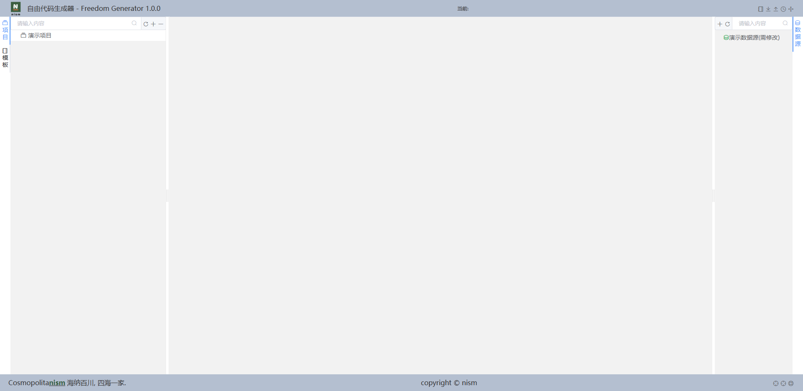
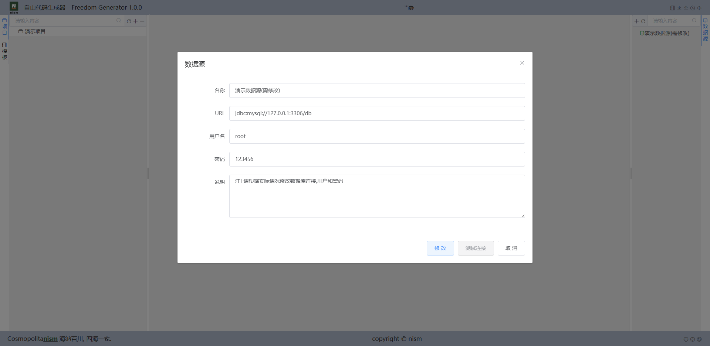
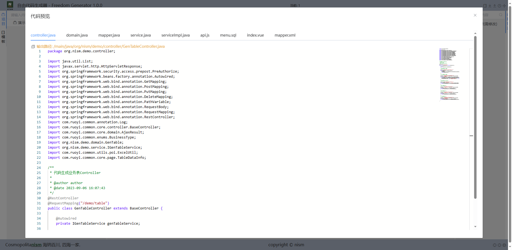
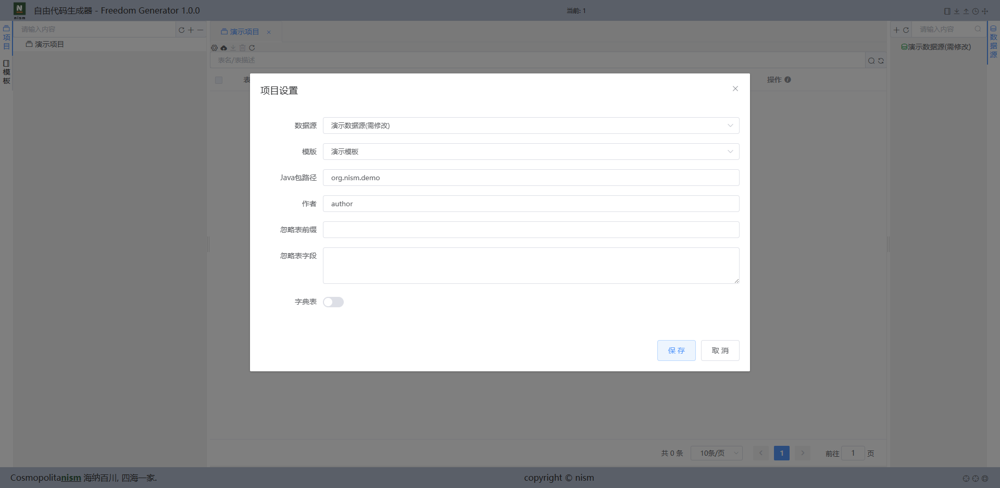
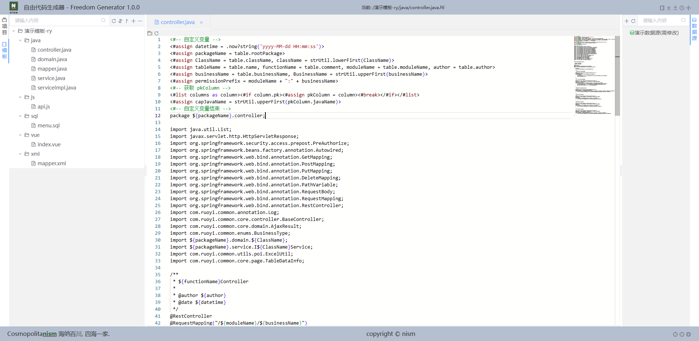

	

<h1 align="center" style="margin: 30px 0 30px; font-weight: bold;">Freedom Generator v1.0.0</h1>
<h4 align="center">自由代码生成器</h4>

	
	
	
     
    
    

## 工具简介

自由代码生成器是一个超自由化定制代码生成的工具，毫无保留给个人及企业免费使用。

* 前端采用Vue2、Element UI、monaco。
* 后端采用Spring Boot2、H2。
* 采用高效的Freemarker作为模板引擎。
* 支持自定义参数、多数据库种类、自定义模板渲染，可多方式适配你的代码结构。
* 本工具需对数据库，模板渲染需要有一定的基础。

## 内置功能

1. 数据源：提供渲染代码生成的数据源信息，基于druid，兼容国内外大多数数据库。
2. 模板：Freemarker渲染模板，根据数据源需要渲染的字段进行渲染，内置常用处理方法。
3. 项目：针对不同数据源，不同模板进行配置，个性化配置数据库表渲染结果。

## 演示图

|       |       |
| ----- | ----- |
|  |  |
|  |  |
|  |  |
